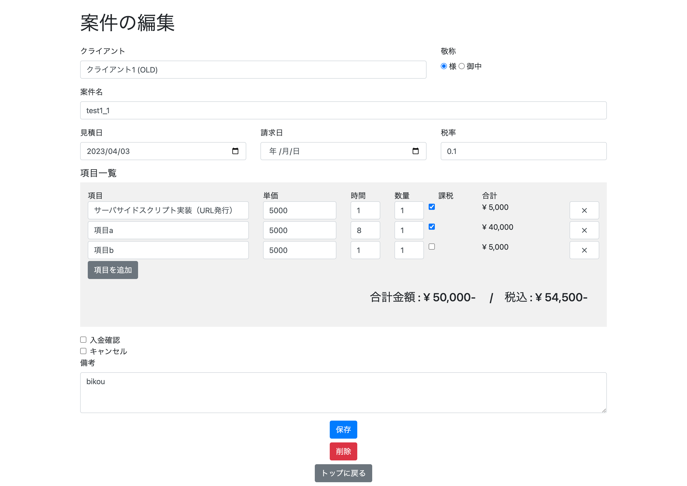

# Invoice App / 請求書 App

Invoice App is a simple web application for creating, editing, and managing quotes and invoices for matters and clients. It works locally only. This application was created by utilizing GPT-4 to speed up the work. Optimized for people working in Japan.

Invoice Appは、案件やクライアントへの見積書・請求書を作成、編集、管理するためのシンプルなウェブアプリケーションです。ローカルでのみ動作します。本アプリはGPT-4の活用により作業を高速化し作成しました。日本で働く人用に最適化しています。


## 機能

- プロジェクトの作成、編集、複製、削除
- 項目の追加、編集、削除
- 見積書と請求書をPDFファイルで出力
- プロジェクトの状態（入金確認、キャンセル）を管理
- ドラッグ&ドロップで項目の順序を変更

## 修正履歴

- [2023.4.7] ページを閉じたら5秒後にサーバが自動終了しるように変更
- [2023.4.7] 自動起動用 start.command追加

## インストール
事前にgitとnodejsがインストールされている必要があります。

1. Clone the repository.

```
git clone https://github.com/utabi/invoice-app
```

2. Install dependencies.

```
cd invoice-app/src
npm install
```

3. Run the application.

```
cd ../
```
click the file named 'start.command'

The application will be accessible at http://localhost:3000.

## カスタマイズ
- 振込先は [/src/pdf/_account.ejs](/src/pdf/_account.ejs) を編集
- 会社（事業主）の情報は [/src/public/company_sign.png](/src/public/company_sign.png) を自分で作成 
（または[/src/pdf/_company.ejs](/src/pdf/_company.ejs) を編集）
- 請求書のデザインは [/src/pdf/_pdf.css](/src/pdf/_pdf.css) を編集

## テクノロジー

- Node.js
- Express
- SQLite
- EJS
- Puppeteer

## ライセンス

[MIT License](LICENSE)



