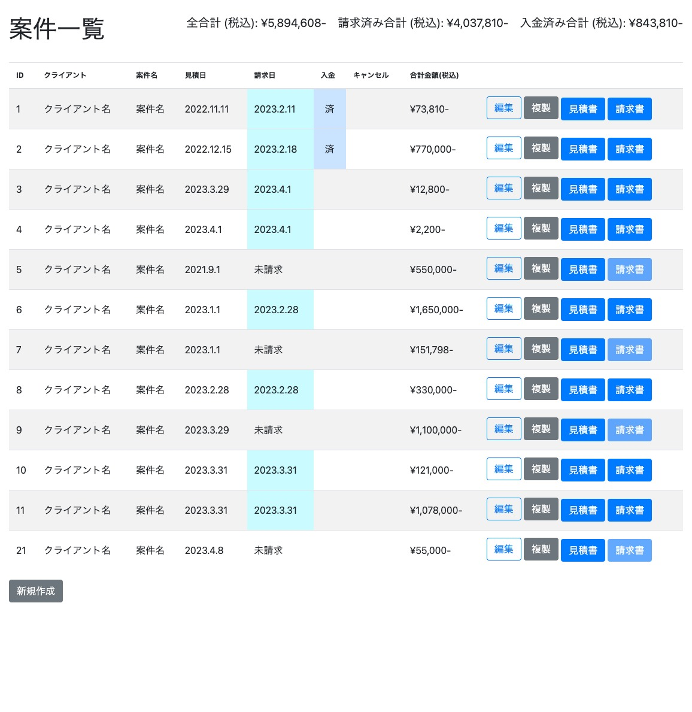

# Invoice App / 請求書 App

Invoice App is a simple web application for creating, editing, and managing quotes and invoices for matters and clients. It works locally only. This application was created by utilizing GPT-4 to speed up the work. Optimized for people working in Japan.

Invoice Appは、案件やクライアントへの見積書・請求書を作成、編集、管理するためのシンプルなウェブアプリケーションです。ローカルでのみ動作します。本アプリはGPT-4の活用により作業を高速化し作成しました。日本で働く人用に最適化しています。



## 機能

- プロジェクトの作成、編集、複製、削除
- 項目の追加、編集、削除
- 見積書と請求書をPDFファイルで出力
- プロジェクトの状態（入金確認、キャンセル）を管理
- ドラッグ&ドロップで項目の順序を変更

## 修正履歴
- [2023.12.11] csvエクスポート機能追加
- [2023.9.10] 適格請求書発行事業者登録番号の追加
- [2023.6.25] ポートを3001から8000へ
- [2023.4.7] ページを閉じたら2分後にサーバが自動終了しるように変更
- [2023.4.7] 自動起動用 start.command (Mac用) 追加

<!-- - [2023.6.23] puppeteerが不安定なので、wkhtmltopdfに変更 -->

## TODO

- データのcsvエクスポート
- 適格請求書発行事業者登録番号の表示
- 年度ごとのソート、範囲指定

## インストール
事前に
- git
- nodejs
<!-- - wkhtmltopdf -->

の2つがインストールされている必要があります。

<!-- 
0. wkhtmltopdfのインストール :
[https://wkhtmltopdf.org/downloads.html](https://wkhtmltopdf.org/downloads.html)
gitとnodejsのインストールは省略します。
-->
1. 好きなフォルダでリポジトリをクローン

```
git clone https://github.com/utabi/invoice-app
```

2. 必要なモジュールをインストール

```
cd invoice-app/src
npm install
```

3. アプリ実行
Macであれば、invoice-app/src/start.command
を実行してください。
または、
```
npm run start
```
で起動します。自動的にブラウザにページが表示されます。http://localhost:3001


4. アプリの編集　: 下記、注意点です。
- 請求書は、請求日が未入力の場合、押せません。請求日を指定するとページ上部の「請求済み合計」に加算されます。
- 入金確認したものは「入金確認」にチェックを入れてください。ページ上部の「入金済み合計」に加算されます。
- 削除ボタンは編集画面の最下部にあります。

5. アプリの終了
ブラウザのページを閉じたあと2分後に自動的に終了します。
または任意のタイミングで、実行中のコマンドを停止させてください。


## カスタマイズ
- 振込先は [/src/pdf/_account.ejs](/src/pdf/_account.ejs) を編集
- 会社（事業主）の情報は [/src/public/company_sign.png](/src/public/company_sign.png) を自分で作成 
（または[/src/pdf/_company.ejs](/src/pdf/_company.ejs) を編集）
- 適格請求書発行事業者登録番号は[/src/pdf/_company.ejs](/src/pdf/_company.ejs)を編集
- 請求書のデザインは [/src/pdf/_pdf.css](/src/pdf/_pdf.css) を編集

## テクノロジー

- Node.js
- Express
- SQLite
- EJS
- puppeteer

## ライセンス

[MIT License](LICENSE)


