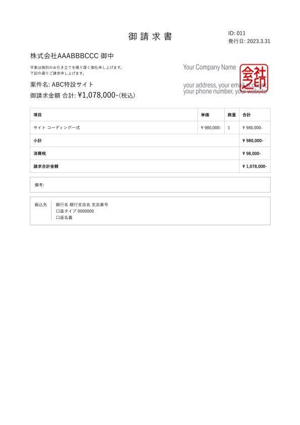

# Invoice App / 請求書 App

Invoice App is a simple web application for creating, editing, and managing quotes and invoices for matters and clients. It works locally only.

Invoice Appは、案件やクライアントへの見積書・請求書を作成、編集、管理するためのシンプルなウェブアプリケーションです。ローカルでのみ動作します。


## Features

- Create, edit, and delete invoice projects
- Add, edit, and delete items
- Export invoices as PDF files
- Manage project status (completed, canceled)
- Change the order of items with drag & drop

## Installation

1. Clone the repository.

```
git clone https://github.com/utabi/invoice-app
```

2. Install dependencies.

```
cd invoice-app/src
npm install
```

3. Run the application.

```
npm start
```

The application will be accessible at http://localhost:3000.

## Tips
- 振込先は [/src/pdf/_account.ejs](/src/pdf/_account.ejs) を編集
- 会社（事業主）の情報は [/src/public/company_sign.png](/src/public/company_sign.png) を自分で作成 
（または[/src/pdf/_company.ejs](/src/pdf/_company.ejs) を編集）
- 請求書のデザインは [/src/pdf/_pdf.css](/src/pdf/_pdf.css) を編集

## Technologies

- Node.js
- Express
- SQLite
- EJS
- Puppeteer

## License

[MIT License](LICENSE)


